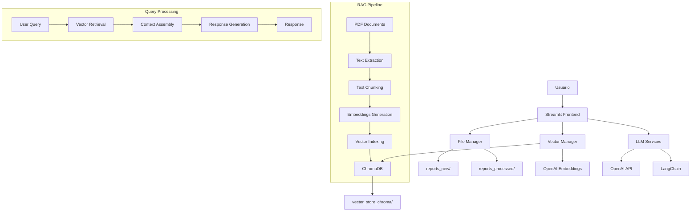
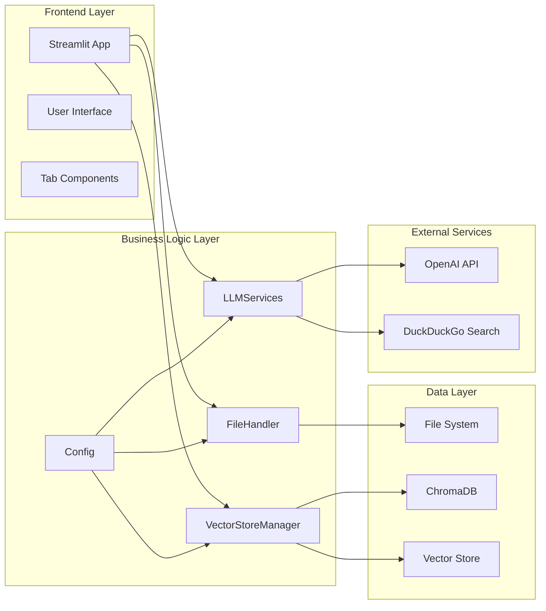
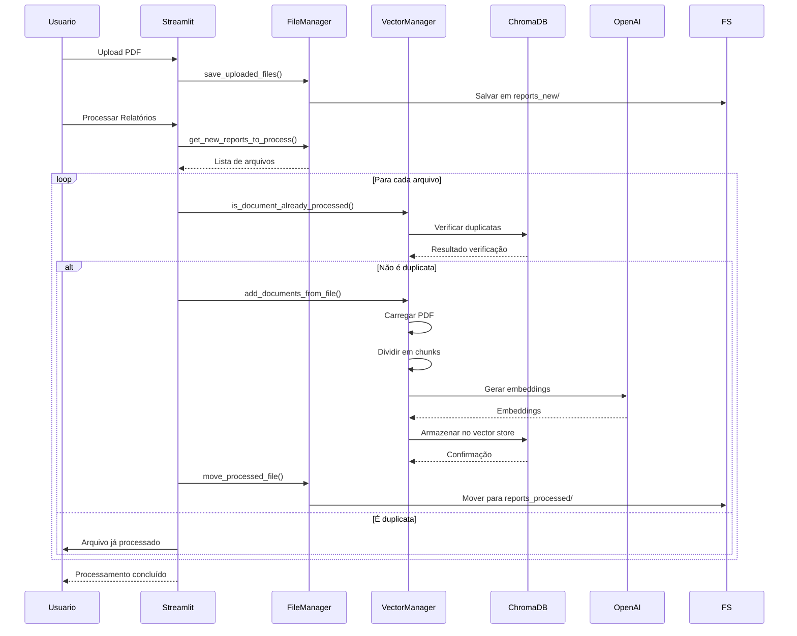
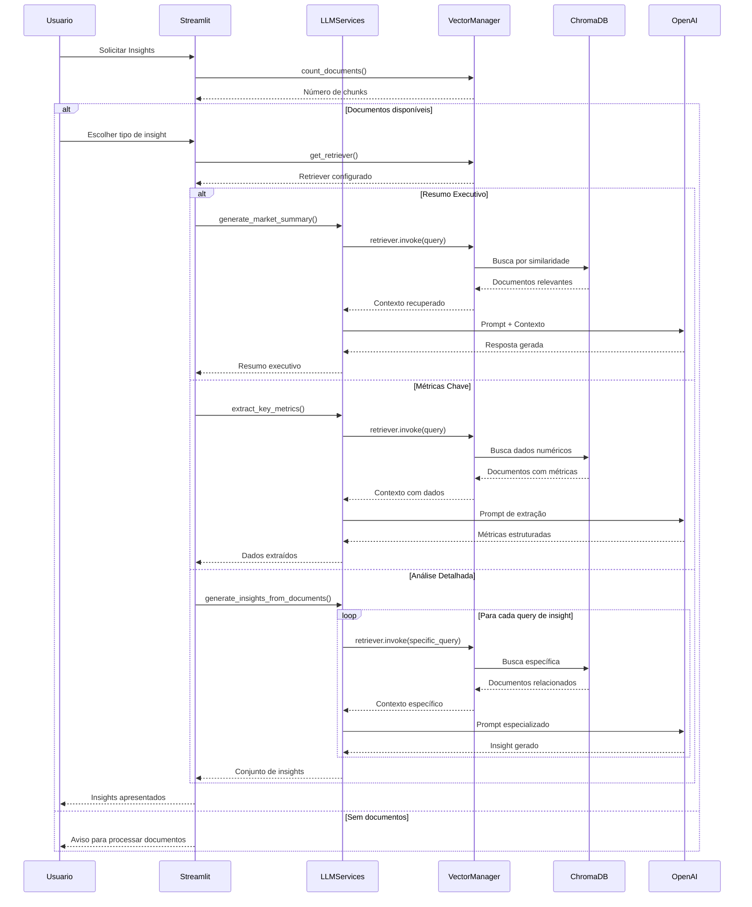
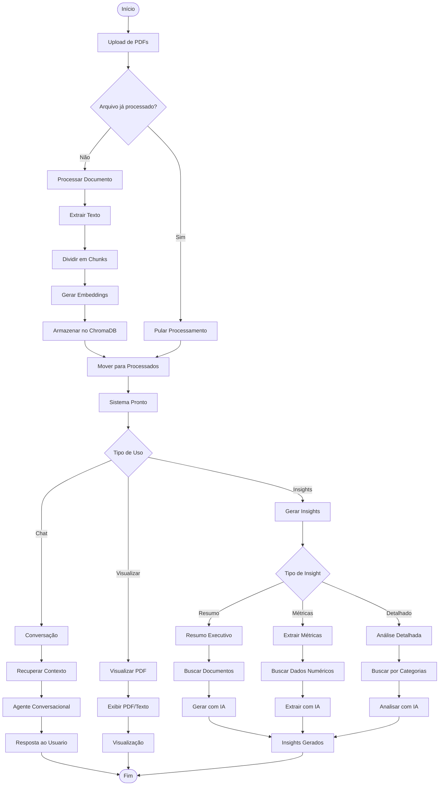

# Agente de Análise de Investimentos RAG

## Visão Geral

O Agente de Análise de Investimentos RAG é uma aplicação avançada que utiliza Retrieval-Augmented Generation (RAG) para análise inteligente de documentos financeiros. A aplicação combina processamento de documentos PDF, embeddings vetoriais, e modelos de linguagem para fornecer insights automáticos, conversação inteligente e análises detalhadas de investimentos.

## Arquitetura do Sistema

### Diagrama de Arquitetura



### Diagrama de Componentes UML



### Diagrama de Sequência - Processamento de Documento



### Diagrama de Sequência - Geração de Insights



### Diagrama de Fluxo de Dados



## Funcionalidades Principais

### 1. Seleção de Modelo LLM
- **Dropdown interativo** na barra lateral para escolha do modelo
- **6 modelos disponíveis**: GPT-4o-mini, GPT-4o, GPT-4-turbo, GPT-3.5-turbo, GPT-4, GPT-5
- **Indicadores visuais** mostrando custo/qualidade de cada modelo
- **Aplicação universal**: modelo selecionado usado em chat, insights e resumos
- **Interface intuitiva** com descrições e recomendações de uso

### 2. Upload e Processamento de Documentos
- Upload de múltiplos PDFs simultaneamente
- Detecção automática de duplicatas
- Processamento com divisão inteligente em chunks
- Geração de embeddings vetoriais
- Armazenamento persistente no ChromaDB

### 3. Interface de Conversação
- Chat interativo com agente IA
- Respostas baseadas no conteúdo dos documentos
- Integração com busca web (DuckDuckGo)
- Memória de conversação persistente
- Processamento de linguagem natural

### 4. Visualização de Documentos
- Visualizador de PDF integrado
- Extração e exibição de texto formatado
- Busca dentro do texto
- Download de arquivos
- Estatísticas de documento

### 5. Geração de Insights Automáticos
- **Resumo Executivo**: Análise geral do mercado
- **Métricas Chave**: Extração de dados numéricos
- **Análise Detalhada**: Insights categorizados por:
  - FIIs Principais
  - Rendimentos e Dividendos
  - Setores de Investimento
  - Recomendações
  - Riscos e Oportunidades
  - Tendências de Mercado

### 6. Funcionalidades de Áudio
- Text-to-Speech (TTS) para resumos
- Text-to-Speech para documentos completos
- Concatenação automática de áudio
- Controles de reprodução nativos
- Download de arquivos de áudio

## Stack Tecnológico

### Frontend
- **Streamlit**: Interface web reativa
- **HTML/CSS**: Customizações de interface
- **JavaScript**: Componentes interativos

### Backend
- **Python 3.12**: Linguagem principal
- **LangChain**: Framework para LLM
- **ChromaDB**: Banco de dados vetorial
- **PyPDF**: Processamento de PDF
- **pydub**: Manipulação de áudio

### Inteligência Artificial
- **Modelos LLM Selecionáveis**: 
  - GPT-4o-mini (padrão - rápido e econômico)
  - GPT-4o (mais inteligente, mais caro)
  - GPT-4-turbo (avançado)
  - GPT-3.5-turbo (econômico)
  - GPT-4 (clássico)
  - GPT-5 (mais avançado e caro)
- **OpenAI Embeddings**: text-embedding-3-small
- **OpenAI TTS**: Síntese de voz (modelo tts-1)
- **DuckDuckGo Search**: Busca web complementar

### Infraestrutura
- **Docker**: Containerização
- **Docker Compose**: Orquestração
- **Environment Variables**: Configuração segura

## Como Usar a Aplicação

### Para Usuários

1. **Acesso Initial**
   - Abra a aplicação em http://localhost:8501
   - Visualize a interface com 3 abas principais

2. **Seleção do Modelo LLM**
   - Na barra lateral, seção "🤖 Configuração do Modelo"
   - Escolha entre 6 modelos disponíveis no dropdown:
     - **GPT-4o-mini**: Rápido e econômico (recomendado para uso geral)
     - **GPT-3.5-turbo**: Mais econômico para tarefas simples
     - **GPT-4o**: Maior qualidade para análises complexas
     - **GPT-4-turbo** e **GPT-4**: Modelos premium
     - **GPT-5**: Mais avançado (maior custo)
   - Observe os indicadores de custo/qualidade abaixo do seletor

3. **Carregamento de Documentos**
   - Na barra lateral, use "Carregar Novos Relatórios"
   - Selecione um ou mais arquivos PDF
   - Aguarde confirmação do upload

4. **Processamento**
   - Clique em "Integrar Novos Relatórios ao Agente"
   - Observe o status de cada arquivo (Novo/Já Processado)
   - Aguarde o processamento RAG completar

5. **Uso das Funcionalidades**
   - **Modelo ativo**: Indicado no topo de cada aba (chat e insights)

   **Aba "Conversar com Agente":**
   - Digite perguntas sobre seus relatórios
   - Receba respostas contextualizadas
   - Histórico de conversação mantido

   **Aba "Visualizador de Relatório":**
   - Selecione um relatório processado
   - Escolha entre visualização PDF ou texto
   - Use funcionalidades de busca e download

   **Aba "Insights dos Relatórios":**
   - Clique em "Resumo Executivo" para análise geral
   - Use "Métricas Chave" para dados específicos
   - "Análise Detalhada" para insights categorizados

6. **Recursos Avançados**
   - Download de insights como arquivos .txt
   - Geração e download de áudios TTS
   - Visualização de estatísticas do sistema

### Para Administradores

1. **Configuração de Ambiente**
   - Configure OPENAI_API_KEY no arquivo .env
   - Ajuste parâmetros em config.py conforme necessário
   - Verifique dependências FFmpeg para TTS

2. **Monitoramento**
   - Acompanhe logs de processamento
   - Monitore uso do ChromaDB
   - Verifique métricas de performance

3. **Manutenção**
   - Limpeza periódica de arquivos duplicados
   - Backup do vector store
   - Atualizações de dependências

## Explicação Técnica Detalhada

### Arquitetura RAG (Retrieval-Augmented Generation)

A aplicação implementa um pipeline RAG completo:

1. **Ingestão de Documentos**
   ```python
   # Fluxo de processamento
   PDF → PyPDFLoader → TextSplitter → OpenAIEmbeddings → ChromaDB
   ```

2. **Recuperação (Retrieval)**
   ```python
   # Busca por similaridade
   Query → Embedding → ChromaDB.similarity_search → Documentos Relevantes
   ```

3. **Geração (Generation)**
   ```python
   # Prompt engineering
   Query + Context → OpenAI GPT → Resposta Fundamentada
   ```

### Componentes Principais

#### VectorStoreManager
- Gerencia embeddings e armazenamento vetorial
- Implementa detecção de duplicatas
- Otimiza consultas por similaridade
- Mantém metadados de documentos

```python
class VectorStoreManager:
    def add_documents_from_file(self, file_path):
        # Verificação de duplicatas
        # Chunking inteligente
        # Geração de embeddings
        # Armazenamento no ChromaDB
```

#### LLMServices
- Encapsula interações com OpenAI
- **Suporte a múltiplos modelos LLM**: Todas as funções aceitam parâmetro `model_name` opcional
- Implementa diferentes tipos de prompts especializados
- Gerencia geração de insights com modelo selecionável
- Controla síntese de voz

```python
def generate_insights_from_documents(retriever, model_name=None):
    # Usa modelo selecionado pelo usuário ou padrão
    # Múltiplas queries especializadas
    # Recuperação contextual
    # Geração de insights categorizados

def setup_agent(retriever, model_name=None):
    # Agente conversacional com modelo configurável
```

#### FileHandler
- Gerencia fluxo de arquivos
- Implementa sistema anti-duplicação
- Controla persistência de dados
- Organiza diretórios de trabalho

### Otimizações Implementadas

1. **Performance**
   - Chunking otimizado (1000 chars, 200 overlap)
   - Retrieval configurável (k=4 padrão)
   - Cache de embeddings no ChromaDB
   - Processamento assíncrono de áudio

2. **Qualidade**
   - **Seleção de modelo otimizada**: 6 opções para diferentes necessidades
   - **GPT-4o-mini padrão**: Equilibra qualidade e custo
   - **Modelos premium disponíveis**: Para análises mais complexas
   - Prompts especializados por tipo de insight
   - Temperature ajustada por caso de uso
   - Validação de entrada e saída
   - Tratamento robusto de erros

3. **Usabilidade**
   - **Seletor de modelo intuitivo**: Dropdown com descrições e indicadores
   - **Indicadores visuais**: Modelo ativo exibido em tempo real
   - **Recomendações de uso**: Guias para escolha do modelo apropriado
   - Interface reativa com Streamlit
   - Progress bars para operações longas
   - Downloads diretos de conteúdo
   - Feedback visual consistente

### Segurança e Boas Práticas

1. **Dados Sensíveis**
   - API keys em variáveis de ambiente
   - .gitignore para dados locais
   - Não exposição de embeddings

2. **Validação**
   - Verificação de tipos de arquivo
   - Sanitização de inputs
   - Tratamento de exceções

3. **Performance**
   - Lazy loading de componentes
   - Gerenciamento eficiente de memória
   - Cleanup automático de recursos

## Configuração e Instalação

### Pré-requisitos
- Python 3.12+
- Docker e Docker Compose
- FFmpeg (para funcionalidades TTS)
- Chave API da OpenAI

### Instalação via Docker (Recomendado)

1. **Clone o repositório**
   ```bash
   git clone <repository-url>
   cd rag-investor-agent
   ```

2. **Configure variáveis de ambiente**
   ```bash
   cp .env.example .env
   # Edite .env com sua OPENAI_API_KEY
   ```

3. **Execute com Docker**
   ```bash
   docker-compose up --build
   ```

### Instalação Local

1. **Ambiente Python**
   ```bash
   python -m venv venv
   source venv/bin/activate  # Linux/macOS
   # ou
   venv\Scripts\activate     # Windows
   ```

2. **Instale dependências**
   ```bash
   pip install -r requirements.txt
   ```

3. **Execute aplicação**
   ```bash
   streamlit run app.py
   ```

## Estrutura do Projeto

```
rag-investor-agent/
├── app.py                 # Interface principal Streamlit
├── config.py             # Configurações centralizadas
├── file_handler.py       # Gerenciamento de arquivos
├── llm_services.py       # Serviços de IA e LLM
├── vector_store.py       # Gerenciador do banco vetorial
├── memory.py            # Gerenciamento de memória
├── prompts.py           # Templates de prompts
├── requirements.txt     # Dependências Python
├── Dockerfile           # Configuração Docker
├── docker-compose.yml   # Orquestração de serviços
├── .env                # Variáveis de ambiente
├── .gitignore          # Arquivos ignorados pelo Git
├── CLAUDE.md           # Documentação técnica
├── reports_new/        # Arquivos pendentes
├── reports_processed/  # Arquivos processados
└── vector_store_chroma/ # Banco de dados vetorial
```

## Contribuição

### Desenvolvimento
1. Faça fork do projeto
2. Crie branch para feature (`git checkout -b feature/nova-funcionalidade`)
3. Commit mudanças (`git commit -am 'Adiciona nova funcionalidade'`)
4. Push para branch (`git push origin feature/nova-funcionalidade`)
5. Abra Pull Request

### Testes
- Execute `python test_rag.py` para testar pipeline RAG
- Use `python test_insights.py` para validar geração de insights
- Execute `python test_duplicates.py` para verificar anti-duplicação

## Licença

Este projeto está licenciado sob a licença MIT. Veja o arquivo LICENSE para mais detalhes.

## Contato

Para questões técnicas ou sugestões de melhorias, entre em contato com a equipe de desenvolvimento.